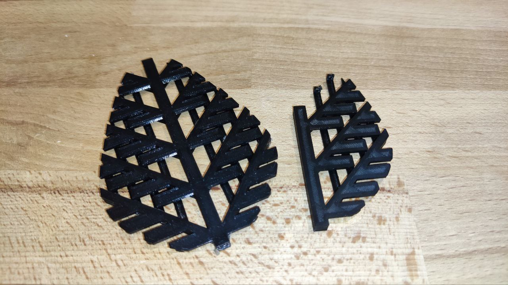

Author: Carolin Berg, Sven Suppelt				Date: 01.11.2022

# OpenFeather

In bird feathers, the individual side branches (barbs) are connected to each other by a hook-and-loop system similar to Velcro. 
However, no commercial models exist to explain this principle to schoolchildren in a simplified form. 
In this repository you will find the stl files of such a model, which can be printed by a commercial FDM-3D printer. A flexible material must be used for printing.

## Background 

In a bird feather, the distal barbules and proximal barbules look something like this: 

[Image credit: Wayne Luallen] (https://globalflyfisher.com/tie-better/the-nature-of-feather-construction-0)

In the OpenFeather, this mechanism is divided into two separate parts:

The yellow part corresponds to the proximal barbule and the green part to the distal barbule. In real life, these two separate parts will be the same color and glued together. 

## Building one
Openfeather is available in a large version, which is based on the shape of a feather, and a small version, which is more like a section of a feather. 
First you print out the two parts of the size you have chosen. We use a Voron V0.1 with 0.25mm Nozzle and use Flexfill TPU 98A as filament:

Then, using a lighter, remove the stringing and glue the two parts together. As glue we use "53339 Tamiya - CA Cement for Rubber Tires", which is just suitable for TPU. 
After the glue has dried, the model is ready for teaching use.

## Additional Resources / Inspiration

Sullivan, T. & Meyers, M. & Arzt, Eduard. (2019). Scaling of bird wings and feathers for efficient flight. Science Advances. 5. eaat4269. 10.1126/sciadv.aat4269. 

