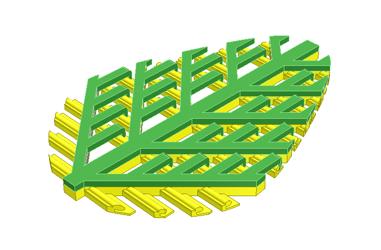
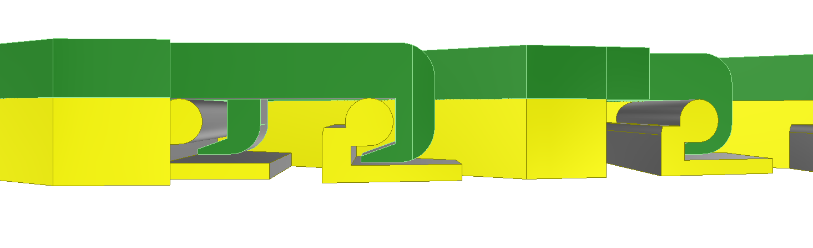
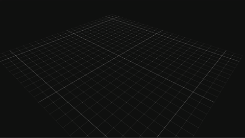

Author: Carolin Berg, Sven Suppelt				Date: 18.09.2022

# OpenFeather

In bird feathers, the individual side branches (barbs) are connected to each other by a hook-and-loop system similar to Velcro. 
However, no commercial models exist to explain this principle to schoolchildren in a simplified form. 
In this repository are the stl files of such a model, which can be printed by a commercial FDM-3D printer. A flexible material must be used for printing.

## Background 

## Printing
